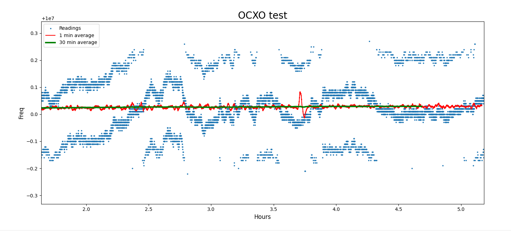

# calibrate_10MHz

FPGA design to help calibrate 10MHz OCXOs to a GPS PPS signal

It samples the PPS signal and the 10MHz reference clock at 1Gb/s, 
and reports the frequency on the serial port (at 115200 baud).

Resolution is 0.01Hz, but is usually limited by the jitter in the 
GPS's PPS signal (usually about 20ns) which gives jumps of about 
0.20Hz in the frequency. This can be averaged over multiple seconds
to give a more precise frequency.

This is set up to be used with a Basys3 dev board, but should easily
adapt to any other board wih two spare I/O pins and a serial port.

## Building
A helper script is proveded to rebuild the project. 

     $ echo source ./build_project.tcl | ./build_project.tcl

This will create an XPR file in the build directory that can be
opened and used to create a bitstream.

## Ploting the output
If you capture the serial output, the "plot.py" Python script may 
be helpful to graph the output.
